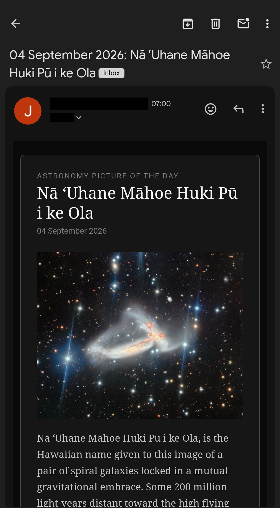

# depression-cherry-aws

[](https://github.com/JamesMcNeill2/depression-cherry-aws/actions/workflows/deploy.yml)

A scheduled AWS Lambda that emails NASA's [Astronomy Picture of the Day](https://apod.nasa.gov/apod/astropix.html) (APOD) every morning, with the image embedded inline and the explanation formatted as an HTML email.

Deployed with AWS CDK. Runs at 7am Europe/London. Gold star if you understand the [reference](https://youtu.be/RBtlPT23PTM) in the repository's name.

<p align="center">
    
</p>

## How It Works

1. EventBridge Scheduler invokes the production Lambda daily at 07:00 Europe/London.
2. The Lambda reads its configuration from AWS Systems Manager Parameter Store.
3. It then fetches the day's APOD entry from `api.nasa.gov`, retrying transient failures with exponential backoff.
4. Finally, it downloads the image, verifies the format from the Content-Type header or the file's magic bytes, and sends an HTML email through Amazon SES.

On days when APOD features a video rather than an image, the email uses the video thumbnail and links through to the video. Where no usable image exists, or the download fails, it degrades to a link-only email rather than failing.

## Repository Layout

Key files. Not exhaustive.

```text
.github/workflows/
  deploy.yml                              Lint, synthesise, deploy on push
  destroy-feature.yml                     Tear down a feature stack when its branch is deleted
depression_cherry_aws/
  depression_cherry_aws_stack.py          Lambda, log group, SSM grants, SES permissions, scheduler
docs/                                     Screenshots used by this README
lambda/
  nasa.py                                 Handler
  apod.py                                 NASA API access and image retrieval
  mailer.py                               Email composition and delivery
  config.py                               Parameter Store lookup and logging setup
  errors.py                               Shared log-and-raise helper
  requirements.txt                        Runtime dependencies (vendored into the package)
app.py                                    CDK entry point; derives the stack name from the branch
cdk.json                                  CDK app configuration
pyproject.toml                            Ruff configuration
requirements.txt                          CDK dependencies
requirements-dev.txt                      Everything needed to work on the project
source.bat                                Activates .venv on Windows via `source .venv/bin/activate`
```

## Prerequisites

- Python 3.13 or later
- Node.js 18 or later, for the CDK CLI: `npm install -g aws-cdk`
- An AWS account, with credentials that can deploy CloudFormation stacks
- A NASA API key from [api.nasa.gov](https://api.nasa.gov)
- Sender and recipient email addresses verified in Amazon SES

If the target account has never run CDK before, bootstrap it once:

```bash
cdk bootstrap aws://ACCOUNT_ID/eu-west-2
```

### Verifying SES Identities

SES → Configuration → Verified identities → Create identity → Email address. AWS sends a
confirmation link that must be clicked within 24 hours.

Identities are per-region, so verify in the same region the Lambda runs in — `eu-west-2`
here. Verifying elsewhere will not help.

New SES accounts are in the sandbox, which means both the sender and the recipient must be
verified. That is no obstacle for a personal mailer, so there is no need to request
production access.

### A Note on Spam Filtering

Sending from a free mailbox address, such as gmail.com, means DKIM will not align: SES
signs with `amazonses.com` while the From header claims gmail.com. DMARC fails as a result,
and Gmail is likely to file the message as spam, since an unauthenticated message claiming
to come from gmail.com is exactly the shape of a phishing attempt.

There is no fix from this side, because the DNS for that domain is not yours to change. Two
options:

- **A Gmail filter** matching the sender or the phrase "Astronomy Picture of the Day", with
  *Never send it to Spam* ticked. Free, takes a moment, and is sufficient when you are the
  only recipient.
- **A domain you own.** Verify it in SES with Easy DKIM, add the three CNAME records, and
  send from an address on that domain. DKIM then aligns and the problem goes away. No
  mailbox is needed at that address — SES only needs to prove domain control. A domain
  costs roughly £8 a year, and DNS hosting is free at Cloudflare.

## Configuration

All configuration lives in SSM Parameter Store as `SecureString` parameters. Nothing is read from `.env` files at runtime.

| Parameter | Purpose |
| --- | --- |
| `nasa-api-key` | API key from [api.nasa.gov](https://api.nasa.gov) |
| `email-from` | Sending address, verified in SES |
| `email-to` | Recipient address, verified in SES while in the sandbox |

The namespace is set by the `PARAM_PREFIX` environment variable, which the CDK stack
populates. It falls back to `/depression-cherry/shared` for local runs.

Every environment currently resolves to that same namespace, so the parameters are created
once and read by prod, dev, feature stacks, and local runs alike. Deploying a branch needs
no new parameters. The trade-off is that changing a value affects every environment at once,
including the next production run; editing `email-to` to redirect a test also redirects
tomorrow morning's real email.

That is deliberate here. There is one NASA API key and one mailbox used, so the
isolation a per-environment namespace would buy has nothing to isolate. `PARAM_PREFIX`
stays configurable so that splitting them later is a change to the stack's environment
variables rather than to the Lambda code.

Create them with:

```bash
aws ssm put-parameter \
  --name /depression-cherry/shared/nasa-api-key \
  --value "YOUR_KEY" \
  --type SecureString
```

## Environments

The stack name and Lambda name are derived from the branch, so each branch gets its own isolated deployment:

| Branch | Stack suffix | Scheduled |
| --- | --- | --- |
| `main` | `prod` | Yes |
| `dev` | `dev` | No |
| `feature/*` | sanitised branch name | No |

Only production runs on a schedule. Dev and feature deployments exist for testing and are invoked manually:

PowerShell:

```powershell
aws lambda invoke --function-name Nasa-dev --payload '{}' --cli-binary-format raw-in-base64-out response.json
```

bash:

```bash
aws lambda invoke \
  --function-name Nasa-dev \
  --payload '{}' \
  --cli-binary-format raw-in-base64-out \
  response.json
```

`--cli-binary-format raw-in-base64-out` is needed because AWS CLI v2 otherwise expects `--payload` to be base64.

Non-production emails carry a subject prefix, `[Dev]`, `[FeatureThing]`, or `[Local]`, so a test send isn't mistaken for a real one.

## Running Locally

Install the dependencies:

```bash
pip install -r requirements-dev.txt
```

You need AWS credentials with `ssm:GetParameters` on the parameter path and `ses:SendRawEmail`, plus a region set. boto3 resolves credentials the same way locally as the execution role does in Lambda.

PowerShell:

```powershell
$env:AWS_PROFILE = "your-profile"
$env:AWS_DEFAULT_REGION = "eu-west-2"
python lambda/nasa.py
```

bash:

```bash
export AWS_PROFILE=your-profile
export AWS_DEFAULT_REGION=eu-west-2
python lambda/nasa.py
```

Set `ENV_NAME` to control the subject prefix.

## Querying the API by Hand

Useful for inspecting a particular entry, or finding a video day to test against. This
queries NASA directly rather than running the handler, so nothing is emailed. The key is
read inline and passed as a header, so it never lands in a shell variable or in the URL,
either of which persists to shell history.

PowerShell:

```powershell
$hdr = @{ "X-Api-Key" = (aws ssm get-parameter --name /depression-cherry/shared/nasa-api-key --with-decryption --query Parameter.Value --output text) }
Invoke-RestMethod "https://api.nasa.gov/planetary/apod?thumbs=true&date=2026-09-04" -Headers $hdr
```

bash:

```bash
curl -s -H "X-Api-Key: $(aws ssm get-parameter \
      --name /depression-cherry/shared/nasa-api-key \
      --with-decryption --query Parameter.Value --output text)" \
  "https://api.nasa.gov/planetary/apod?thumbs=true&date=2026-09-04"
```

On Git Bash for Windows, prefix the `aws` call with `MSYS_NO_PATHCONV=1`, or it rewrites the leading `/` in the parameter path into a Windows path.

Swap `&date=YYYY-MM-DD` for `&start_date=YYYY-MM-DD&end_date=YYYY-MM-DD` to fetch a range of entries. The two forms
are mutually exclusive; the API rejects a request carrying both. Entries where
`thumbnail_url` is empty are worth testing too, since the API returns the field without a
value on some video days.

## Deployment

Deployment is automatic. Pushing to `main`, `dev`, or any `feature/**` branch runs the deploy workflow, which lints, synthesises, and deploys that branch's stack.

Deleting a `feature/**` branch triggers a second workflow that destroys the corresponding stack. It resolves the stack name via `cdk list`, refuses to proceed if the result is empty or resolves to prod or dev, and verifies afterwards that the stack is gone.

Both workflows authenticate to AWS via OIDC. No long-lived credentials are stored.

To deploy manually:

```powershell
$env:BRANCH_NAME = "dev"
cdk deploy
```

## Development

Linting is Ruff, configured in `pyproject.toml` and enforced in CI before anything is deployed:

```bash
ruff check .
```

## Costs

Effectively nothing at this volume. The Lambda runs once a day well inside the free tier, SES charges $0.10 per thousand emails plus $0.12/GB for attachments, standard-tier SSM parameters are free to store and read, and CloudWatch logs are retained for a week. All in all, under a penny a month.

## Future Improvements

### Failure Alarm on the Production Lambda

If the 07:00 run fails, the only signal is an email that does not arrive, which gets noticed eventually but not promptly. A CloudWatch alarm on the function's `Errors` metric, wired to an SNS topic, would turn that into a notification. This works because the handler deliberately lets exceptions propagate rather than catching them, so a failure is recorded as a failed invocation.

The harder case is the function never running at all, because the scheduler broke. That needs an alarm on `Invocations` falling below one over a 25 hour period, which is fiddlier to get right.

### SES Event Notifications

SES can publish bounce, complaint, and delivery events to SNS via a configuration set. That would replace "the email did not arrive" with an actual delivery record, and is one of the benefits of SES that this project does not yet use.

## License

MIT. See [LICENSE](LICENSE).

NASA imagery is generally not copyrighted, but individual APOD entries often credit a photographer in a `copyright` field, which the email displays beneath the image.
